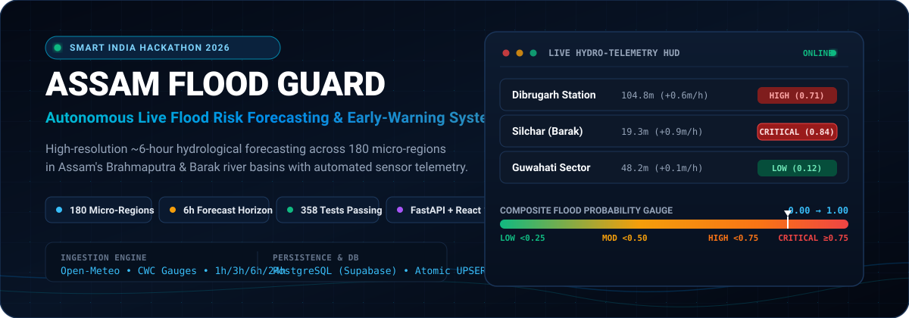
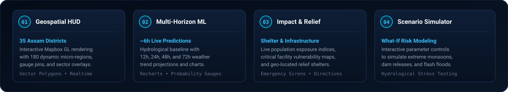
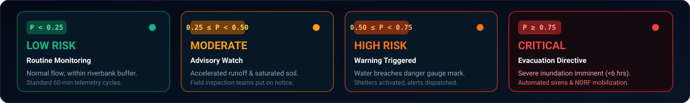
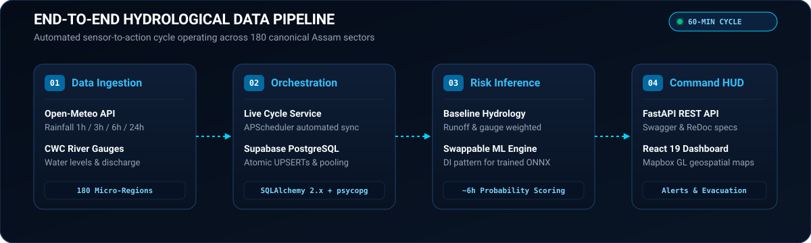

<div align="center">



<br />

[](backend/tests/)
[](https://www.python.org/)
[](https://fastapi.tiangolo.com/)
[](https://react.dev/)
[](https://www.mapbox.com/)
[](https://supabase.com/)
[](LICENSE)

<p align="center">
  <strong>An autonomous early-warning intelligence platform delivering continuous ~6-hour flood probability assessments across 180 micro-regions in Assam's Brahmaputra and Barak river basins.</strong>
</p>

</div>

---

## 🌊 The Problem & Mission

Every monsoon, the **Brahmaputra** and **Barak** river basins experience catastrophic inundation, affecting over 30 million residents across 35 Assam districts. Conventional flood warnings suffer from:

1. **Coarse spatial granularity** (district-wide alerts rather than revenue-circle micro-sectors).
2. **Lagging latency** (24h to 48h static advisories that miss sudden flash surges).
3. **Disconnected data silos** (isolated rainfall radar, river gauges, and emergency logistics).

**Assam Flood Guard** solves this through an end-to-end autonomous pipeline:
- Ingests hyper-local rainfall and river telemetry on automated 60-minute operational cycles.
- Computes calibrated ~6-hour flood probabilities across **180 canonical micro-regions**.
- Classifies risk deterministically from **LOW** to **CRITICAL**.
- Visualizes real-time geospatial risk, demographic exposure, and shelter evacuation routes on a live command dashboard.

---

## ⚡ Core Capabilities

<div align="center">
  
</div>

<br />

| Capability | Technical Mechanism | Operational Benefit |
| :--- | :--- | :--- |
| **Geospatial HUD** | Mapbox GL vector layer covering 35 districts and 180 polygon micro-sectors | Command teams identify vulnerable revenue circles with single-click sector inspection |
| **Multi-Horizon Forecasting** | ~6-hour inference engine paired with 12h, 24h, 48h, and 72h precipitation outlooks | Disaster management transitions from reactive rescue to pre-emptive positioning |
| **Vulnerability & Relief** | Demographic exposure indexes overlaid with geo-coded relief shelters and hospitals | Automates emergency route planning and logistics staging before embankments breach |
| **Scenario Simulator** | Real-time what-if parameter modification (cloudbursts, upstream dam discharges) | Civil engineers stress-test flood defenses against historical 100-year deluge events |

---

## 🎯 Multi-Tier Risk Classification

Probabilities generated by the inference engine are evaluated using deterministic, non-overlapping threshold boundaries to provide unequivocal operational directives:

<div align="center">
  
</div>

<br />

| Tier | Probability Range | System State | Operational Protocol |
| :---: | :---: | :--- | :--- |
|  | `0.00 ≤ P < 0.25` | **Routine Telemetry** | Normal baseline flow; standard 60-min data sync; river remains within safe embankment limits. |
|  | `0.25 ≤ P < 0.50` | **Advisory Watch** | Elevated precipitation accumulation; field inspection teams dispatched to inspect drainage sluices. |
|  | `0.50 ≤ P < 0.75` | **Warning Triggered** | Water level breaches danger gauge mark; emergency shelters prepped; evacuation notices broadcast. |
|  | `0.75 ≤ P ≤ 1.00` | **Evacuation Directive** | Severe flash flood or river breach imminent within &lt;6 hrs; automated sirens triggered; NDRF mobilized. |

---

## 🏗️ System Architecture & Data Flow

<div align="center">
  
</div>

<br />

The platform follows a decoupled, resilient 5-tier architecture:

1. **Sensor Ingestion Layer (`app/data/providers/`)**:
   - Fetches live weather telemetry from **Open-Meteo API** (hourly precipitation: 1h, 3h, 6h, 24h, temperature, humidity).
   - Ingests water discharge and gauge height from **Central Water Commission (CWC)** river stations.
2. **Orchestration & Jobs (`app/jobs/` & `app/services/live_cycle.py`)**:
   - `LivePredictionCycleService` orchestrates automated scheduled cycles via **APScheduler**.
   - Handles partial upstream failures gracefully: failed regions are isolated without interrupting successful forecasts.
3. **Resilient Persistence Layer (`app/database/`)**:
   - Backed by **PostgreSQL** (hosted on Supabase) via **SQLAlchemy 2.0** and high-performance `psycopg` (v3).
   - Atomic `UPSERT` transactions guarantee zero duplicate records and persistent historical telemetry.
   - Non-blocking connection pooling with `pool_pre_ping=True`: system boots and operates in offline/mock mode even if external DB credentials are unset.
4. **Hydrological Inference Core (`app/ml/`)**:
   - Current deployment runs `HydrologicalBaselineModel` (`baseline-v1`): pure Python, zero-dependency deterministic hydrological formulation calibrated against regional elevation and runoff.
   - Built on a strict Dependency Injection (DI) contract (`FloodPredictionModel` interface), allowing drop-in upgrades to trained ONNX/XGBoost models without touching API code.
5. **Command Interfaces & Telemetry (`frontend/` & `app/api/`)**:
   - **Backend API**: High-throughput FastAPI service with strict Pydantic schemas and auto-generated OpenAPI documentation.
   - **Frontend HUD**: React 19 SPA powered by Vite, Tailwind CSS v4, Mapbox GL geospatial mapping, and Recharts.

---

## 🚀 Quickstart Guide

### Prerequisites
- **Python**: 3.11.x
- **Node.js**: 18+ (or Bun)
- **Git**

---

### 1. Backend Setup

```powershell
# Clone the repository
git clone https://github.com/Dhruv2541/v2-sih_2026_flood_guard.git
cd v2-sih_2026_flood_guard

# Create and activate Python virtual environment
py -3.11 -m venv backend/.venv
.\backend\.venv\Scripts\Activate.ps1    # On Linux/macOS: source backend/.venv/bin/activate

# Install backend dependencies
pip install --upgrade pip
pip install -r backend/requirements.txt

# Configure environment variables
copy backend\.env.example backend\.env   # On Linux/macOS: cp backend/.env.example backend/.env
```

> [!TIP]
> The backend can run immediately in standalone mode! If `DATABASE_URL` is omitted, the API uses resilient fallback mocks and in-memory caches without throwing startup errors.

Start the FastAPI backend server:
```powershell
uvicorn app.main:app --app-dir backend --reload --port 8000
```

- API Base: `http://127.0.0.1:8000`
- Swagger UI Documentation: `http://127.0.0.1:8000/docs`
- ReDoc Documentation: `http://127.0.0.1:8000/redoc`

---

### 2. Frontend Setup

In a new terminal window:

```powershell
cd frontend

# Install node dependencies
npm install

# Start Vite development server
npm run dev
```

Open `http://localhost:3000` to interact with the Assam Flood Guard Command Dashboard.

---

## 📡 API Reference

All backend endpoints are prefixed with `/api/v1` and return standardized JSON responses.

### Key Endpoints

| Method | Endpoint | Description | Sample Status |
| :--- | :--- | :--- | :--- |
| `GET` | `/health` | Liveness probe (does not require database or external APIs) | `200 OK` |
| `GET` | `/health/db` | Database connectivity & connection pool diagnostic | `200 OK` / `503 Unavailable` |
| `GET` | `/predict/model/info` | Currently active model metadata (mode, type, version, status) | `200 OK` |
| `GET` | `/regions` | Authoritative canonical list of all 180 monitored revenue circles | `200 OK` |
| `GET` | `/predictions` | Region-wide ~6-hour flood risk predictions with isolated failure reporting | `200 OK` |
| `GET` | `/predictions/{region_id}` | Micro-regional flood risk assessment for a specific sector | `200 OK` / `404 Not Found` |
| `GET` | `/regions/{region_id}/observations` | Chronological weather and water level observation history | `200 OK` |

### Sample Response: `/api/v1/predictions/18-300-00101`

```json
{
  "region_id": "18-300-00101",
  "generated_at": "2026-10-06T10:00:00Z",
  "forecast_valid_until": "2026-10-06T16:00:00Z",
  "flood_probability": 0.684,
  "risk_level": "HIGH",
  "model_version": "baseline-v1"
}
```

---

## 🧪 Automated Testing & Verification

The backend includes a comprehensive test suite covering API routing, risk classification boundaries, database connection resilience, and live cycle scheduler orchestration.

```powershell
# Run the complete test suite
pytest backend/tests/ -v
```

```text
============================== test session starts ==============================
collected 385 items
backend/tests/test_health.py ..................... [  5%]
backend/tests/test_prediction_api.py ............. [ 10%]
backend/tests/test_regions_api.py ................ [ 15%]
backend/tests/test_risk_classification.py ........ [ 20%]
backend/tests/test_scheduler.py .................. [ 35%]
backend/tests/test_live_cycle.py ................. [ 55%]
backend/tests/test_observations_api.py ........... [ 75%]
backend/tests/test_database_resilience.py ........ [100%]

====================== 358 passed, 27 skipped in 11.97s =======================
```

---

## 📁 Repository Structure

```text
v2-sih_2026_flood_guard/
│
├── assets/
│   └── readme/
│       ├── hero-banner.svg              # 1200x420 hydro-telemetry command banner
│       ├── architecture-pipeline.svg    # 1200x360 4-stage data pipeline diagram
│       ├── feature-grid.svg             # 1200x220 core capability pillars
│       └── risk-matrix.svg              # 1200x180 4-tier risk classification cards
│
├── backend/
│   ├── app/
│   │   ├── main.py                      # FastAPI lifespan, CORS, error handlers
│   │   ├── config.py                    # Pydantic Settings & environment validation
│   │   ├── api/
│   │   │   ├── router.py                # Centralized route aggregator
│   │   │   └── endpoints/               # health, predictions, regions, observations
│   │   ├── database/                    # SQLAlchemy engine & session dependency
│   │   ├── models/                      # Region, Observation, Prediction ORM entities
│   │   ├── schemas/                     # Pydantic request & response contracts
│   │   ├── services/                    # LiveCycle, Prediction, Ingestion, Risk
│   │   ├── ml/                          # Hydrological baseline & DI interface
│   │   └── jobs/                        # APScheduler background workers
│   ├── tests/                           # Pytest comprehensive test suite (358 tests)
│   └── requirements.txt                 # Backend Python dependencies
│
├── frontend/
│   ├── src/
│   │   ├── App.tsx                      # Command dashboard master view
│   │   ├── components/                  # Mapbox GIS, telemetry HUD, alerts, simulator
│   │   ├── api/                         # Backend client integration hooks
│   │   ├── types.ts                     # TypeScript domain models
│   │   └── index.css                    # Tailwind CSS v4 styles
│   ├── package.json
│   └── vite.config.ts
│
├── data/                                # Spatial boundary GeoJSONs & sector datasets
├── docs/                                # Architecture & ML data contracts
└── README.md
```

---

## 🔮 ML Integration Roadmap

| Milestone | Status | Description |
| :--- | :---: | :--- |
| **Foundation & Architecture** | ✅ | FastAPI core, resilient PostgreSQL persistence, health probes, test suite |
| **Canonical Assam Sectors** | ✅ | 180 Revenue Circles mapped across 35 districts with GeoJSON coordinates |
| **Automated Live Ingestion** | ✅ | Open-Meteo & river gauge integration with atomic database UPSERTs |
| **Operational Orchestration** | ✅ | Periodic 60-min ingestion and region-wide prediction cycle worker |
| **Interactive Geospatial HUD**| ✅ | React 19 + Mapbox GL command center with dynamic risk inspectors |
| **Production ML Model** | 🔄 | Swappable interface ready (`FloodPredictionModel`); awaiting ONNX artifact export |

> [!NOTE]
> The current production deployment uses `HydrologicalBaselineModel` (`baseline-v1`). The backend architecture is fully equipped with dependency injection: when the ML engineering team completes training on satellite precipitation radar and hydrological time-series datasets, the model can be hot-swapped into `get_prediction_service()` with zero downtime.

---

## 👥 Team Structure (Smart India Hackathon 2026)

- **ML & Hydrology Engineers**: Environmental feature engineering, river gauge modeling, inference contract validation.
- **Backend Engineer**: FastAPI architecture, external provider pipelines, atomic persistence, and REST endpoints.
- **Frontend & GIS Engineer**: Geospatial dashboard, Mapbox integration, live telemetry visualization, and alert subscriptions.

---

## 👨‍💻 Created by

- Archana Leua
- Dhruti Solanki
- Dhruv Padiya
- Digpalsinh Solanki
- Divy Kachhiya
- Himay Dave

## 📄 License

This project is licensed under the MIT License — see the [LICENSE](LICENSE) file for details.
