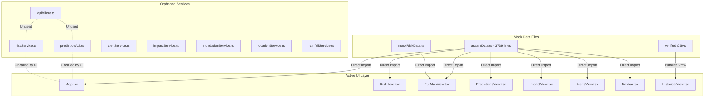

# FloodGuard SIH 2026 — Comprehensive Frontend Audit

**Project:** FloodGuard Flood Inundation & Early-Warning Platform  
**Architecture Rule:** Frontend displays data; Backend performs calculations and business logic.  
**Source of Truth:** Backend `risk_level` is authoritative.  
**Audit Date:** October 3, 2026  
**Status:** Audit Complete — Read-Only Mode (No Application Source Code Modified)  

---

## Executive Summary & High-Level Findings

A comprehensive code audit of the FloodGuard SIH 2026 React + TypeScript + Vite frontend was conducted. 

### Key Discoveries:
1. **Pervasive Mock Data Coupling:** 
   The application UI is deeply coupled to static mock objects in `src/data/assamData.ts` (specifically `ASSAM_SECTORS`, a 172 KB / 3,739-line file, and `ACTIVE_FLOOD_ALERTS`) and `src/data/mockRiskData.ts` (`mockRegionRiskData`).
2. **Orphaned Service & Client Layer:** 
   An HTTP transport client (`src/api/client.ts`) and a suite of service abstractions (`predictionApi.ts`, `riskService.ts`, `alertService.ts`, `historicalService.ts`, `impactService.ts`, `inundationService.ts`, `locationService.ts`, `rainfallService.ts`) exist in the codebase. However, **none of the primary UI components actually import or call them**. Instead, `App.tsx` and the view components import `ASSAM_SECTORS` directly and pass synchronous props.
3. **Frontend Risk & Hydrological Calculations:** 
   Significant business logic, risk tier classifications (`CRITICAL`, `HIGH`, `MODERATE`, `LOW`, `SEVERE`), hydrograph water stages, runoff index categorizations, and synthetic inundation polygon generation (`inundationGeoJson`) are executed directly on the client.
4. **Missing Production States:** 
   Because data is accessed synchronously from static constants, almost all views lack real asynchronous loading spinners/skeletons, network error recovery screens, and empty states.
5. **Environment Configuration Gaps:** 
   No `.env` or `.env.example` file exists in the repository. Furthermore, environment variables are inconsistent (`VITE_API_BASE_URL` vs. `VITE_API_URL`), and `vite-env.d.ts` only declares `VITE_API_URL`, missing `VITE_API_BASE_URL` and `VITE_MAPBOX_ACCESS_TOKEN`.

---

## 1. Core Architecture Review: Business Rule Compliance

| Architecture Requirement | Current Implementation Status | Compliance Assessment |
| :--- | :--- | :--- |
| **Frontend communicates with backend via HTTP APIs** | `src/api/client.ts` and `predictionApi.ts` define HTTP fetch logic, but are unused by UI. `riskService.ts` contains an uncalled `fetch('/api/simulate')`. UI bypasses API and reads local files. | **NON-COMPLIANT** |
| **No direct Supabase/PostgreSQL access** | Audited all imports and dependencies. No direct DB connection or database driver exists on the client. | **COMPLIANT** |
| **No direct ML model execution on client** | No ONNX/TensorFlow.js models loaded. However, synthetic heuristic math and Bayesian calculations are simulated on frontend. | **PARTIALLY COMPLIANT** (simulations must be moved to backend) |
| **Frontend must not calculate flood risk classification** | Risk tiers (`CRITICAL`, `HIGH`, `MODERATE`, `LOW`) are mapped, compared, and derived in multiple frontend files. | **NON-COMPLIANT** |
| **Frontend must not fabricate API values** | Hydrograph stages, rainfall forecasts, inundation polygons, and ticket IDs are procedurally generated in the frontend. | **NON-COMPLIANT** |
| **Backend `risk_level` is single source of truth** | Frontend overrides backend values or calculates fallback indices when displaying badges and directives. | **NON-COMPLIANT** |
| **Every API component needs Loading, Success, Empty, Error states** | Most views assume synchronous data. Only `predictionApi.ts` has a state enum, but it is not connected to UI. | **NON-COMPLIANT** |

---

## 2. Detailed Technical Audit (Sections A – Q)

### A. Existing Pages / Views
The application uses tab-based client routing inside `src/App.tsx` controlled by `activeTab: string`:
1. **Overview / Home (`activeTab === 'overview'`)**: Command center with live alert strip, `RiskHero` with district search and count-up metrics, `AssamOverviewMap` (2D state overview), and `ActionCards`.
2. **Risk Map (`activeTab === 'map'`)**: Dedicated GIS command view rendering `FullMapView` which embeds `InteractiveMap` (Mapbox GL), layer switcher drawer, 72h playback scrubber, and `SectorInspector`.
3. **Predictions & Hydrograph (`activeTab === 'predictions'`)**: Deep analytical hydro-meteorological view rendering `PredictionsView` with river stage hydrograph, precipitation hyetograph, inundation progression, and ConvLSTM factor explainability.
4. **Impact & Infrastructure (`activeTab === 'impact'`)**: Exposure assessment view rendering `ImpactView` with infrastructure asset inventory (hospitals, schools, roads, bridges) and vulnerable demographic stats.
5. **Alerts & Directives (`activeTab === 'alerts'`)**: Emergency public warnings view rendering `AlertsView` with severity filtering and community SMS broadcast registration form.
6. **Historical Archive (`activeTab === 'historical'`)**: Longitudinal analysis view rendering `HistoricalView` with verified 2018–2025 event archives, trend comparison charts, official government reports, and satellite evidence catalog.
7. **Methodology & Architecture (`activeTab === 'methodology'`)**: Technical and institutional documentation view rendering `MethodologyView` and `MethodologySection` describing the 9-step model pipeline, CWC gauges, IMD radar, and SAR satellites.
8. **Sub-View Modals**:
   - `ShelterModal`: Relief camp directory with medical facility filters.
   - `GuideModal`: Bilingual (Assamese, Bodo, English) survival instructions.
   - `DataInaccuracyModal`: Citizen human-in-the-loop (HITL) ground-truth discrepancy reporter.
   - `DiagnosticModal`: Hydro-diagnostic technical sheet (currently unrendered/orphaned).

### B. Existing Reusable Components
- **Navigation & Brand:** `Navbar.tsx`, `Logo.tsx`, `FloodGuardBrandReveal.tsx`, `FloodGuardBrandText.tsx`, `ThemeToggle.tsx`, `Footer.tsx`.
- **Feedback & Prompts:** `SelectDistrictPrompt.tsx`, `RiskStatusAnimation.tsx`, `AlertDirectiveBanner.tsx`, `ActionCards.tsx`.
- **Maps:** `InteractiveMap.tsx`, `AssamOverviewMap.tsx`.
- **Inspection & Modals:** `SectorInspector.tsx`, `ShelterModal.tsx`, `GuideModal.tsx`, `DataInaccuracyModal.tsx`, `DiagnosticModal.tsx`.
- **History Sub-components (`src/components/history/`):**
  - `HistoricalHeader.tsx`
  - `YearSelector.tsx`
  - `FloodMetricCard.tsx`
  - `HistoricalTrendChart.tsx`
  - `EventSummary.tsx`
  - `OfficialEvidence.tsx`
  - `SatelliteEvidence.tsx`
  - `DataMethodology.tsx`
- **Orphaned / Unused Components:**
  - `HeroSearch.tsx` (superseded by `RiskHero.tsx`)
  - `RegionalTelemetryView.tsx` (unreferenced in `App.tsx`)
  - `SafetyGuideView.tsx` (superseded by `GuideModal.tsx`)
  - `ProximityMatrix.tsx` (unreferenced)

### C. Existing API Calls
- `src/api/client.ts`: Defines generic `request<T>(path, opts)` wrapper over `fetch` using `import.meta.env.VITE_API_BASE_URL`. Handles query params, abort controller timeouts (default 15s), and structured `ApiError`. **Currently called by: 0 files.**
- `src/services/predictionApi.ts`:
  - `POST ${API_BASE_URL}/api/predict` (sector-specific prediction).
  - `POST ${API_BASE_URL}/api/predict/batch` (multi-sector prediction).
  - `GET ${API_BASE_URL}/api/health` (health check).
  - **Currently called by: 0 files.**
- `src/services/riskService.ts`:
  - `POST ${VITE_API_URL || 'http://localhost:8000'}/api/simulate` with payload `{ severity_multiplier: 1.0, use_live_weather: true }`.
  - **Currently called by: 0 files.**
- `src/hooks/useGeolocation.ts`:
  - `GET https://nominatim.openstreetmap.org/reverse?format=json&lat=${lat}&lon=${lng}&zoom=10` (OpenStreetMap Nominatim reverse geocoding).
  - **Active and called when user clicks "Use Location".**

### D. Existing Mock Data
1. `src/data/assamData.ts` (172,238 bytes, 3,739 lines):
   - `ASSAM_SECTORS`: 7 full sector definitions (`dhemaji`, `majuli`, `lakhimpur`, `dibrugarh`, `tinsukia`, `barpeta`, `cachar`) with coordinates, demographics, infrastructure arrays, hourly forecast timelines, causal factors, and hydrological stages.
   - `CWC_GAUGE_STATIONS`: 10 river telemetry gauge stations.
   - `ACTIVE_FLOOD_ALERTS`: 5 mock emergency directives.
   - `HISTORICAL_DATA`: 8 historical years (2018–2025) with damages, affected populations, and peak river levels.
   - `RELIEF_CAMPS`: 6 emergency shelters with capacities, contact officers, and phone numbers.
   - `EMERGENCY_CONTACTS`: State and district emergency contact numbers.
   - `REGIONAL_GUIDES`: Multilingual preparedness directives (English, Assamese, Bodo).
2. `src/data/mockRiskData.ts` (905 bytes):
   - `mockRegionRiskData`: 5 district records with hardcoded `flood_probability`, `risk_level` (`SEVERE`, `HIGH`, `MODERATE`, `LOW`), and timestamp.
3. `src/data/assam_flood_events_2018_2025_verified.csv` (1,013 bytes):
   - Authoritative historical statistics parsed by `historicalDataService.ts`.
4. `src/data/assam_flood_proof_sources.csv` (1,740 bytes):
   - Authoritative government links and satellite source URLs parsed by `historicalDataService.ts`.

### E. Existing Hardcoded Values
- **Hotspots in `AssamOverviewMap.tsx`:** Fixed 3 hotspots (`Dhemaji`, `Majuli`, `Lakhimpur`) with hardcoded risk metrics, flood probabilities (87.6%, 81.2%, 64.8%), and water depths.
- **Monitoring Station Count in `riskService.ts`:** Hardcoded `cwcMonitoringStations: 10`.
- **Infrastructure Fallback Demographics in `ImpactView.tsx`:** Default fallbacks: 14,200 children, 9,800 elderly, 3,200 pregnant women, 24,500 livestock, 18,200 informal dwellings.
- **Hydrograph Stage Deltas in `PredictionsView.tsx`:** Hardcoded offsets from `stageAbsolute` (`-1.6m`, `-0.9m`, `+0.45m`, `+0.85m`, `+0.70m`, `+0.25m`, `-0.40m`).
- **Hyetograph Scaling in `PredictionsView.tsx`:** Multiplied by `0.4` and `0.6` to generate intermediate timeline steps.
- **Ticket ID Generation in `DataInaccuracyModal.tsx`:** Fabricated string `HITL-${sector.stationCode}-${randomCode}`.
- **Synthetic Geographic Bounding Boxes:** `useGeolocation.ts` defines hardcoded lat/lng bounds for Assam (`24.0` to `28.0` lat, `89.5` to `96.0` lng).

### F. Existing Fallback Behavior
- **Default District:** When `selectedSectorId` is null, modals and components default to `ASSAM_SECTORS.dhemaji`.
- **Mapbox Token Fallback:** 
  - `AssamOverviewMap.tsx` displays a blue-bordered information box when `VITE_MAPBOX_ACCESS_TOKEN` is unset.
  - `InteractiveMap.tsx` displays a dark card modal stating "Map temporarily unavailable" if token fails or Mapbox emits an error event.
- **API Failure Fallbacks:**
  - `predictionApi.ts` catches network errors and returns `{ status: 'unavailable', fallback: mockSector }`.
  - `riskService.ts` catches ML fetch errors with `console.warn` and falls back to `baseSector = ASSAM_SECTORS[sectorId]`.

### G. Existing Frontend Risk Calculations
The frontend currently calculates and categorizes risk in multiple locations:
1. **`riskService.ts` (Lines 35–40):** Maps backend risk score (0, 1, 2, 3) to arbitrary frontend vulnerability indices (15, 45, 75, 95) and assigns hazard levels:
   `backendData.risk_score === 3 ? 'CRITICAL' : backendData.risk_score === 2 ? 'HIGH' : backendData.risk_score === 1 ? 'MODERATE' : 'LOW'`.
2. **`riskService.ts` (Lines 66–78):** Calculates `criticalCount` and high-risk district totals by filtering sectors where `s.hazardLevel === 'CRITICAL' || s.hazardLevel === 'HIGH'`.
3. **`rainfallService.ts` (Lines 10–20):** `calculateRunoffPotential` computes `(rainfallMm / 200) * (soilSaturationPercent / 100)` and categorizes into:
   - `Flash Torrent Surge Velocity` (>75)
   - `Rapid Overland Ponding` (>50)
   - `Moderate Gravity Drainage` (>30)
   - `Low Runoff Velocity` (<=30)
4. **`historicalDataService.ts` (Lines 199–215):** `deriveSeverity` evaluates population, lives lost, damage crore, and affected districts to determine `Catastrophic`, `Severe`, `Moderate`, or `Low impact`.
5. **`mapData.ts` (Lines 14–37):** `inundationGeoJson` mathematically synthesizes 6-vertex flood polygons around sector coordinates using `latitudeRadius = 0.045 + Math.min(sector.inundationAreaKm2 / 14000, 0.03)`.
6. **`AlertDirectiveBanner.tsx` (Line 44):** Selects ASDMA directive level via frontend condition: `ASDMA DIRECTIVE LEVEL {sector.hazardLevel === 'CRITICAL' ? '3' : '2'} ACTIVATED`.

### H. Existing Loading States
- **Present:**
  - `RiskHero.tsx`: `locationLoading` spinner on "Use Location" button; `isAnalyzing` animated pulse badge on sector change.
  - `AssamOverviewMap.tsx`: Spinner overlay displayed while `!isMapLoaded`.
  - `DataInaccuracyModal.tsx`: Step-by-step simulated progress bar during form submission.
- **Missing:**
  - `App.tsx` has no global loading skeleton for initial sector hydration.
  - `PredictionsView.tsx`, `ImpactView.tsx`, and `AlertsView.tsx` render instantaneously from static memory without loading indicators.
  - No skeleton loaders exist for Recharts containers or table listings.

### I. Existing Error States
- **Present:**
  - `InteractiveMap.tsx`: Catches `map.on('error')` and displays GIS unavailable modal.
  - `AssamOverviewMap.tsx`: Displays fallback UI if Mapbox access token is missing.
  - `App.tsx`: Displays a toast banner if `useGeolocation` fails or user is outside Assam.
- **Missing:**
  - No HTTP network error banner exists on `App.tsx`, `AlertsView.tsx`, `PredictionsView.tsx`, or `ImpactView.tsx`.
  - No retry mechanisms exist on failed API calls.

### J. Existing Empty States
- **Present:**
  - `App.tsx`: `SelectDistrictPrompt.tsx` is displayed on `map`, `predictions`, and `impact` tabs if `!currentSector`.
  - `RiskHero.tsx`: Renders a dashed prompt box ("Select a district to view flood risk") if `!currentSector`.
  - `InteractiveMap.tsx`: Returns `emptyGeoJson()` if coordinates or data are missing.
- **Missing:**
  - `AlertsView.tsx`: If `filteredAlerts.length === 0`, nothing is rendered (blank container, no empty message).
  - `ImpactView.tsx`: If infrastructure list for a selected category is empty, no empty state card is displayed.
  - Search inputs lack a clear "No matching districts found" dropdown state.

### K. Existing Mobile / Responsive Behavior
- **Mobile Navigation:** `Navbar.tsx` implements a collapsible hamburger slide-out drawer with touch targets >= 44px (`min-h-11`).
- **Viewport Protection:** `App.tsx` and parent wrappers use `w-full max-w-full overflow-x-hidden min-w-0` to prevent horizontal blowout on 360px–414px mobile devices.
- **Map Responsiveness:** 
  - `InteractiveMap.tsx` uses `ResizeObserver` to resize Mapbox canvas upon orientation or window resize.
  - Floating inspector on `FullMapView.tsx` collapses to off-canvas on mobile with toggle button.
  - Scrubber timeline on `InteractiveMap.tsx` wraps and allows horizontal touch scrolling (`touch-pan-x`).
- **Issues Found on Mobile:**
  - `HistoricalTrendChart.tsx` can experience label overlap on screens < 400px when all 4 metric lines are toggled.
  - In `ImpactView.tsx`, the horizontal sector pills overflow without a clear fade-out indicator on small viewports.

### L. Existing Environment Variables
- `VITE_API_BASE_URL`: Defined in `client.ts` and `predictionApi.ts` as the root URL for backend API.
- `VITE_API_URL`: Defined in `riskService.ts` (lines 13–14) and `vite-env.d.ts`. **Conflict: Two different variable names are used for the backend URL.**
- `VITE_MAPBOX_ACCESS_TOKEN`: Used in `InteractiveMap.tsx` and `AssamOverviewMap.tsx`.
- **Defect:** No `.env` or `.env.example` file is committed to the repository. Developers cloning the project have no reference template for required keys.

### M. Existing Mapbox Integration
- Package: `mapbox-gl@^3.31.0` with `mapbox-gl/dist/mapbox-gl.css`.
- **Implementations:**
  1. `AssamOverviewMap.tsx`:
     - Centered on Assam `[92.94, 26.20]`, zoom `7.2`, constrained bounds `[[89.69, 24.13], [96.02, 28.02]]`.
     - Uses custom DOM HTML markers with pulsing CSS animations for hotspots.
     - Dark and light Mapbox vector tile styles toggled via `ThemeContext`.
  2. `InteractiveMap.tsx`:
     - 3D terrain support via `mapbox-dem` raster elevation source.
     - Clustered infrastructure point layers with custom cluster expansion zoom.
     - Dynamic GeoJSON sources: `flood-zone`, `gauges`, `infrastructure`, and `active-sector`.
     - Timeline forecast animation scrubber (0 to 72 hours).

### N. Existing Recharts Integration
- Package: `recharts@^3.10.1`.
- **Implementations:**
  1. `PredictionsView.tsx`:
     - AreaChart for 72-hour river stage vs. danger level reference line.
     - BarChart for hourly/cumulative precipitation hyetograph.
     - LineChart for inundation spread progression.
     - Horizontal BarChart for ConvLSTM causal feature weights.
  2. `HistoricalTrendChart.tsx`:
     - Multi-axis Area and Line charts comparing affected population, fatalities, crop loss, and economic damages across 2018–2025.
  3. `DiagnosticModal.tsx`:
     - Hydrograph stage chart and precipitation runoff bars.
- **Pattern Note:** Recharts components use `ResponsiveContainer width="100%"` wrapped inside parent elements with fixed min-heights, preventing container collapse.

### O. Existing TypeScript Types (`src/types.ts`)
- Key domain types defined:
  - `AlertSeverity = 'CRITICAL' | 'HIGH' | 'MODERATE' | 'LOW' | 'RESOLVED' | 'SEVERE'`
  - `RiskLevel = "LOW" | "MODERATE" | "HIGH" | "SEVERE"`
  - `SectorData`: Comprehensive district hydrology model (117 lines).
  - `CausalFactor`: Explainable AI attribution feature.
  - `RainfallForecast`: Precipitation and catchment indices.
  - `ForecastStepData`: Hourly time-series step.
  - `InfrastructureItem`: Hospitals, schools, bridges, roads.
  - `GaugeStation`: CWC gauge metadata and live stage.
  - `ReliefCamp`: Emergency shelters and facilities.
  - `FloodAlert`: Public warnings.
  - `FloodEvent`: Verified historical archive record.
  - `ProofSource`: Official government memorandum reference.
  - `SatelliteEvidenceItem`: NRSC/ISRO satellite scene metadata.
- **Type Inconsistency:** `AlertSeverity` contains `'SEVERE'` and `'CRITICAL'`, while `RiskLevel` contains only `'SEVERE'`, creating union mismatch when mapping between `RegionRisk` and `SectorData`.

### P. Existing Services That Should Become API Services
Every service in `src/services/` currently returns static mock data and must be refactored into real HTTP API callers using `src/api/client.ts`:
1. `riskService.ts`: Refactor `getAllSectors()`, `getSectorRisk()`, and `getGlobalRiskStats()` to call backend `/api/sectors` and `/api/risk/summary`.
2. `predictionApi.ts`: Connect existing `/api/predict` and `/api/predict/batch` endpoints directly to UI components.
3. `alertService.ts`: Replace `ACTIVE_FLOOD_ALERTS` with `GET /api/alerts` and replace simulated `subscribeToAlerts` with `POST /api/alerts/subscribe`.
4. `impactService.ts`: Replace mock sector lookups with `GET /api/sectors/:id/impact`.
5. `inundationService.ts`: Replace mock calculations with `GET /api/sectors/:id/inundation` returning real GeoJSON polygons.
6. `rainfallService.ts`: Replace mock data and rational runoff formula with `GET /api/sectors/:id/rainfall`.
7. `locationService.ts`: Replace in-memory string search with backend search or keep fast client-side caching of backend-delivered sector index.
8. `historicalDataService.ts` / `historicalService.ts`: While historical CSV data is verified, long-term architecture should serve these records from `GET /api/historical/events`.

### Q. Existing Components That Directly Depend on Mock Data
The following components directly import from `src/data/assamData.ts` or `src/data/mockRiskData.ts` instead of using an API service layer:
1. `src/App.tsx`: Directly imports `ASSAM_SECTORS`.
2. `src/components/RiskHero.tsx`: Directly imports `ASSAM_SECTORS`.
3. `src/components/Navbar.tsx`: Directly imports `ACTIVE_FLOOD_ALERTS`.
4. `src/components/AlertsView.tsx`: Directly imports `ACTIVE_FLOOD_ALERTS`.
5. `src/components/FullMapView.tsx`: Directly imports `ASSAM_SECTORS` and `mockRegionRiskData`.
6. `src/components/PredictionsView.tsx`: Directly imports `ASSAM_SECTORS`.
7. `src/components/ImpactView.tsx`: Directly imports `ASSAM_SECTORS`.
8. `src/components/ActionCards.tsx`: Directly imports `EMERGENCY_CONTACTS`.
9. `src/components/ShelterModal.tsx`: Directly imports `RELIEF_CAMPS`.
10. `src/components/GuideModal.tsx`: Directly imports `REGIONAL_GUIDES`.
11. `src/components/mapData.ts`: Directly imports `CWC_GAUGE_STATIONS`.
12. `src/hooks/useGeolocation.ts`: Directly imports `ASSAM_SECTORS`.
13. `src/components/HeroSearch.tsx`: Directly imports `ASSAM_SECTORS`.
14. `src/components/ProximityMatrix.tsx`: Directly imports `ASSAM_SECTORS`.

---

## 3. Page-by-Page Audit Entries

### Page: Overview / Home Command Center (`activeTab === 'overview'`)
- **Current status:** Fully rendered, highly interactive.
- **Data source:** In-memory static mock data (`ASSAM_SECTORS`, `EMERGENCY_CONTACTS`).
- **API connected:** No.
- **Mock data:** `ASSAM_SECTORS`, `ACTIVE_FLOOD_ALERTS`, `EMERGENCY_CONTACTS`.
- **Hardcoded values:** Hotspots in `AssamOverviewMap` (Dhemaji, Majuli, Lakhimpur); emergency telephone numbers.
- **Frontend calculations:** Count-up interpolation (`useCountUp`); high-risk sector filtering (`hazardLevel === 'CRITICAL' || 'HIGH'`); distance sorting in `useGeolocation`.
- **Loading state:** Present for "Use Location" GPS resolution and 700ms simulated analysis on sector switch; absent for initial page load.
- **Error state:** Toast banner for geolocation errors or out-of-Assam coordinates; Mapbox token warning box.
- **Empty state:** Fallback prompt ("Select a district to view flood risk") displayed when no sector is selected.
- **Mobile status:** Responsive. Single-column card flow on viewports < 768px.
- **Required changes:** Replace `ASSAM_SECTORS` import in `App.tsx` and `RiskHero.tsx` with async data fetching from `riskService.ts`. Connect `AssamOverviewMap` markers to live backend sector summaries.

---

### Page: Full GIS Risk Map View (`activeTab === 'map'`)
- **Current status:** Fully rendered with Mapbox GL.
- **Data source:** `ASSAM_SECTORS` mutated with `mockRegionRiskData`.
- **API connected:** No.
- **Mock data:** `ASSAM_SECTORS`, `mockRegionRiskData`, `CWC_GAUGE_STATIONS`.
- **Hardcoded values:** Synthetic inundation polygon radii (`0.045 + inundationAreaKm2 / 14000`); legend risk thresholds.
- **Frontend calculations:** Dynamic sector mutation in `FullMapView.tsx` (lines 28–33); procedural polygon generation in `inundationGeoJson`.
- **Loading state:** Mapbox canvas load spinner; no data fetching skeleton.
- **Error state:** Map layer error modal ("Map temporarily unavailable").
- **Empty state:** `SelectDistrictPrompt` shown if `currentSector` is null.
- **Mobile status:** Responsive. Collapsible floating inspector panel with toggle tab.
- **Required changes:** Inundation polygons must be fetched from backend GeoJSON API rather than generated via client math. Sector risk must come directly from backend without client patching.

---

### Page: Predictions & Hydrograph View (`activeTab === 'predictions'`)
- **Current status:** Fully rendered with Recharts.
- **Data source:** `currentSector` prop originating from `ASSAM_SECTORS`.
- **API connected:** No.
- **Mock data:** `ASSAM_SECTORS[id].timeline`, `ASSAM_SECTORS[id].rainfall`, `ASSAM_SECTORS[id].factors`.
- **Hardcoded values:** Hydrograph stage offsets (`-1.6m`, `-0.9m`, `+0.45m`, `+0.85m`); rainfall timeline multipliers (`0.4`, `0.6`).
- **Frontend calculations:** Procedural generation of 8 hydrograph stage data points and 5 hyetograph bars from base numbers.
- **Loading state:** None. Charts render synchronously from memory.
- **Error state:** None.
- **Empty state:** `SelectDistrictPrompt` shown if `currentSector` is null.
- **Mobile status:** Responsive. Recharts use 100% width; horizontal scroll on factor badges.
- **Required changes:** Replace synthetic mathematical offsets with real backend forecast time-series data from `/api/predict`. Add loading spinners during sector transition.

---

### Page: Impact Assessment View (`activeTab === 'impact'`)
- **Current status:** Fully rendered with category filters and modal triggers.
- **Data source:** `currentSector` prop originating from `ASSAM_SECTORS`.
- **API connected:** No.
- **Mock data:** `ASSAM_SECTORS[id].infrastructureList`, `ASSAM_SECTORS[id].vulnerableDemographics`.
- **Hardcoded values:** Demographic fallback numbers (14,200 children, 9,800 elderly, etc.).
- **Frontend calculations:** Client-side filtering of infrastructure list by `type`.
- **Loading state:** None.
- **Error state:** None.
- **Empty state:** `SelectDistrictPrompt` shown if `currentSector` is null; missing empty state if category filter yields 0 assets.
- **Mobile status:** Responsive. Touch-friendly filter buttons.
- **Required changes:** Fetch live infrastructure asset lists and demographic counts from backend `/api/sectors/:id/impact`. Remove hardcoded demographic fallback counts.

---

### Page: Active Alerts & Directives View (`activeTab === 'alerts'`)
- **Current status:** Fully rendered with severity filtering and broadcast registration.
- **Data source:** `ACTIVE_FLOOD_ALERTS` mock array.
- **API connected:** No.
- **Mock data:** `ACTIVE_FLOOD_ALERTS` (5 alerts).
- **Hardcoded values:** District options in subscription dropdown (`Dhemaji`, `Majuli`, `Lakhimpur`, `Dibrugarh`, `Tinsukia`, `Barpeta`).
- **Frontend calculations:** Severity filtering (`alert.riskLevel === filterSeverity`); alert count calculation.
- **Loading state:** None.
- **Error state:** None.
- **Empty state:** None (renders blank container if no alerts match filter).
- **Mobile status:** Responsive. Card stacking on mobile.
- **Required changes:** Connect to `GET /api/alerts`. Wire subscription form to `POST /api/alerts/subscribe`. Add loading skeleton, network error state, and "No active alerts matching criteria" empty state.

---

### Page: Historical Flood Archive (`activeTab === 'historical'`)
- **Current status:** Authoritative, fully rendered with verified CSV data.
- **Data source:** `assam_flood_events_2018_2025_verified.csv` and `assam_flood_proof_sources.csv` parsed via `historicalDataService.ts`.
- **API connected:** No (bundled as raw text via Vite `?raw` imports).
- **Mock data:** None (uses verified government records from ASDMA / NRSC / MHA).
- **Hardcoded values:** Satellite catalog metadata (sensor, acquisition date, descriptions in `historicalDataService.ts`).
- **Frontend calculations:** `deriveSeverity()` derives severity tier from CSV figures; average impact calculations across years.
- **Loading state:** None (synchronously available from bundle).
- **Error state:** None.
- **Empty state:** None.
- **Mobile status:** Responsive. Year selector scrolls horizontally.
- **Required changes:** Retain verified dataset integrity. Migrate data fetching from bundle-embedded CSV to backend `/api/historical` endpoint while preserving strict government source citations.

---

### Page: Methodology & Sensors View (`activeTab === 'methodology'`)
- **Current status:** Fully rendered educational and architectural reference view.
- **Data source:** Static architectural arrays in `MethodologyView.tsx` and SVG steps in `MethodologySection.tsx`.
- **API connected:** No (static informational page).
- **Mock data:** Static model benchmark figures (F1-Score 93.2%, MAE 0.18m, etc.).
- **Hardcoded values:** Agency names, sensor orbits, latency benchmarks.
- **Frontend calculations:** None.
- **Loading state:** None needed (static content).
- **Error state:** None.
- **Empty state:** None.
- **Mobile status:** Responsive. Grid wraps to single column on mobile.
- **Required changes:** None required for core business logic; optionally fetch live model version and telemetry station ping status from backend `/api/health`.

---

### Sub-View Modal: Shelter Directory Modal (`ShelterModal`)
- **Current status:** Modal dialog triggered from Overview, Impact, or Alerts.
- **Data source:** `RELIEF_CAMPS` in `assamData.ts`.
- **API connected:** No.
- **Mock data:** 6 relief camp objects with static officer contacts.
- **Hardcoded values:** Camp names, phone numbers, capacities.
- **Frontend calculations:** Client-side checkbox filter for `hasMedicalPost`.
- **Loading state:** None.
- **Error state:** None.
- **Empty state:** None (always displays camps).
- **Mobile status:** Responsive scrollable modal dialog with touch close button.
- **Required changes:** Fetch designated shelters dynamically based on selected sector from `GET /api/sectors/:id/shelters`.

---

### Sub-View Modal: Ground-Truth Inaccuracy Report (`DataInaccuracyModal`)
- **Current status:** Modal dialog triggered from `SectorInspector`.
- **Data source:** Local React form state.
- **API connected:** No.
- **Mock data:** Simulated submission flow with nested `setTimeout` timers.
- **Hardcoded values:** Fabricated ticket ID format `HITL-${sector.stationCode}-${randomCode}`.
- **Frontend calculations:** Client-side random number generation for ticket ID.
- **Loading state:** Multi-phase progress bar simulating Bayesian calibration.
- **Error state:** Basic client file validation (size > 8MB or invalid type).
- **Empty state:** None.
- **Mobile status:** Responsive. Full-height scroll on small mobile screens.
- **Required changes:** Replace fake `setTimeout` submission with real `POST /api/reports/inaccuracy` multipart upload. Replace random ticket generator with backend-returned confirmation ID.

---

## 4. Comprehensive Inventory of Frontend Risk Classification Logic

The following code locations violate the core business rule (*"Frontend displays data; Backend performs calculations and business logic; Backend risk_level is the source of truth"*). These must be refactored to consume backend classifications directly:

```
┌───────────────────────────────────────────────────────────────────────────────────────────┐
│ FILE & LINE RANGE       │ PATTERN FOUND                                │ VIOLATION TYPE   │
├─────────────────────────┼──────────────────────────────────────────────┼──────────────────┤
│ src/services/           │ backendData.risk_score === 3 ? 'CRITICAL' :  │ Client maps risk │
│ riskService.ts:35-40    │ backendData.risk_score === 2 ? 'HIGH' : ...  │ scores to levels │
├─────────────────────────┼──────────────────────────────────────────────┼──────────────────┤
│ src/services/           │ sectors.filter(s => s.hazardLevel ===        │ Client filters   │
│ riskService.ts:68       │ 'CRITICAL' || s.hazardLevel === 'HIGH')      │ risk severity    │
├─────────────────────────┼──────────────────────────────────────────────┼──────────────────┤
│ src/services/           │ calculateRunoffPotential(): index > 75 ?     │ Hydrological     │
│ rainfallService.ts:10-20│ 'Flash Torrent Surge' : index > 50 ? ...     │ classification   │
├─────────────────────────┼──────────────────────────────────────────────┼──────────────────┤
│ src/services/           │ deriveSeverity(): pop >= 50 || lives >= 150  │ Disaster metric  │
│ historicalDataService:  │ -> 'Catastrophic'; pop >= 30 -> 'Severe' ... │ classification   │
│ lines 199-215           │                                              │                  │
├─────────────────────────┼──────────────────────────────────────────────┼──────────────────┤
│ src/components/         │ getRiskColor(): case 'CRITICAL':             │ Hardcoded color  │
│ AssamOverviewMap:80-93  │ case 'SEVERE': return '#dc2626' ...          │ tier switch      │
├─────────────────────────┼──────────────────────────────────────────────┼──────────────────┤
│ src/components/         │ circle-color: ['match', ['get', 'risk'],     │ Mapbox layer     │
│ InteractiveMap:162      │ 'CRITICAL', '#ef4444', 'HIGH', '#f97316' ...]│ risk matching    │
├─────────────────────────┼──────────────────────────────────────────────┼──────────────────┤
│ src/components/         │ ASDMA DIRECTIVE LEVEL                        │ Client decides   │
│ AlertDirectiveBanner:44 │ {sector.hazardLevel === 'CRITICAL' ? '3':'2'}│ directive level  │
├─────────────────────────┼──────────────────────────────────────────────┼──────────────────┤
│ src/components/         │ isUrgent = sector.hazardLevel === 'CRITICAL' │ Client decides   │
│ SectorInspector:22-24   │ || sector.hazardLevel === 'HIGH'             │ urgency state    │
├─────────────────────────┼──────────────────────────────────────────────┼──────────────────┤
│ src/components/         │ criticalAlertCount = ACTIVE_FLOOD_ALERTS.    │ Client counts    │
│ Navbar:37-39            │ filter(a => a.riskLevel === 'CRITICAL' ...)  │ critical alerts  │
├─────────────────────────┼──────────────────────────────────────────────┼──────────────────┤
│ src/components/         │ const isCritical = alert.riskLevel ===       │ Conditional risk │
│ AlertsView:96           │ 'CRITICAL'                                   │ UI branching     │
├─────────────────────────┼──────────────────────────────────────────────┼──────────────────┤
│ src/lib/                │ if (norm === 'CRITICAL' || norm === 'SEVERE')│ Centralized UI   │
│ riskLevelConfig:22-68   │ tier: 'CRITICAL', badgeBg: 'bg-red-600' ...  │ visual token map │
└───────────────────────────────────────────────────────────────────────────────────────────┘
```

> **Architecture Clarification:** 
> Pure visual mapping (e.g., `riskLevelConfig.ts` applying red background for `'CRITICAL'`) is acceptable for a frontend view layer. However, **deciding what is Critical/High**, calculating runoff categories, or synthesizing hazard indices from raw numbers is strictly forbidden on the frontend and must be returned by the backend API.

---

## 5. Mock-Data & API Dependencies Summary



---

## 6. Recommended Implementation Order (Phased Roadmap)

To transition this frontend safely to a pure display layer communicating with the HTTP backend without breaking the existing UI:

### Phase 1: Environment & Client Foundation
1. Create `.env.example` defining `VITE_API_BASE_URL` and `VITE_MAPBOX_ACCESS_TOKEN`.
2. Standardize on `VITE_API_BASE_URL` across `src/api/client.ts`, `src/services/riskService.ts`, and `src/vite-env.d.ts`.
3. Add TypeScript interface declarations for all environment variables in `src/vite-env.d.ts`.

### Phase 2: Unify API Transport & Service Contracts
1. Refactor `riskService.ts`, `alertService.ts`, `impactService.ts`, `rainfallService.ts`, and `inundationService.ts` to use `src/api/client.ts` for all HTTP requests.
2. Ensure every service method returns standard response shapes matching backend FastAPI schemas with structured error handling.
3. Remove synthetic mathematical calculations (`calculateRunoffPotential`, `inundationGeoJson` math) from frontend services.

### Phase 3: Connect Core State in App.tsx
1. Introduce async fetching in `src/App.tsx` on initial load (`getSectors()` from `riskService`).
2. Add comprehensive top-level loading skeletons and network error recovery screens.
3. Replace hardcoded `currentSector` resolution with state populated from API.

### Phase 4: Connect Individual Views & Remove Direct Mock Imports
1. **Overview & RiskHero:** Populate from live sector summary API; wire "Use Location" to backend coordinate lookup.
2. **AlertsView & Navbar:** Fetch active alerts from `alertService.getActiveAlerts()`; wire SMS subscription form to backend endpoint; add empty state for 0 active alerts.
3. **FullMapView & InteractiveMap:** Replace `mockRegionRiskData` mutation with backend sector payload; fetch real inundation GeoJSON vector polygons.
4. **PredictionsView:** Replace procedural hydrograph/hyetograph math with real timeline arrays returned by `/api/predict`.
5. **ImpactView & ShelterModal:** Fetch live infrastructure asset lists and designated shelter records from backend.

### Phase 5: Production Polish & State Hardening
1. Implement loading skeletons across Recharts containers.
2. Add empty states across search dropdowns, alert filters, and asset categories.
3. Verify mobile responsiveness and touch target ergonomics across all newly connected views.
4. Verify strict read-only compliance: zero business logic or risk calculations remaining on frontend.
